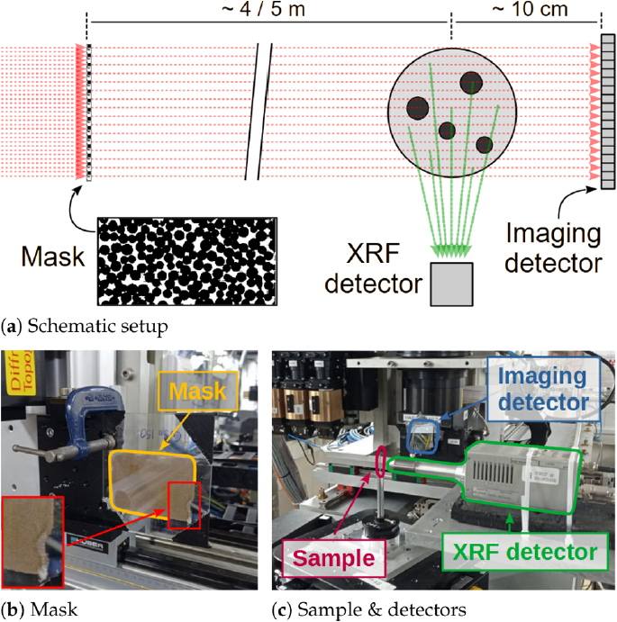

## Overview

Synchrotron-based X-ray Fluorescence Ghost Imaging (XRF-GI) is an innovative imaging technique that aims to reduce acquisition time and radiation dose, compared to traditional X-ray fluorescence pencil beam scanning.
This method might also lead to improved spatial resolution, and is could help mitigating the need for precise beam focusing.
Our study in <a href="/publications/#J15">[J15]</a> demonstrates an experimental setup and computational technique that allows for the imaging of samples using structured beams, which illuminate the entire field of view, rather than scanning with a focused beam. This approach is particularly beneficial for studying sensitive samples, such as liquids, which cannot be easily moved or scanned using traditional methods.

## Experimental Setup

The experimental setup involves a large structuring mask composed of randomly distributed CuSn spheres, positioned upstream of the sample. By translating this mask, different beam shapes are created, illuminating the entire field of view (FoV) rather than scanning point by point. This approach allows for the acquisition of spatial information across the entire FoV in each realization.

  

    
  

  

    <b>Figure 1</b>: Synchrotron XRF-GI setup: (<b>a</b>) Schematic synchrotron XRF-GI setup; (<b>b</b>) CuSn mask, whose corner
    is shown in the inset on the bottom left; and (<b>c</b>) sample, imaging detector with Si attenuation wafers, and XRF detector.
  

Two detectors are employed:
- A 2D imaging detector positioned downstream of the sample to capture the transmitted beam.
- An XRF single-pixel detector placed perpendicular to the beam to record fluorescence signals.

The simultaneous acquisition of both signals ensures that each XRF measurement corresponds directly to its beam structure, mitigating errors from sample movement or flux variations.

## Data Processing and Reconstruction

The data processing pipeline involves several computational steps to reconstruct real-space images from the acquired data. We use of principal component analysis (PCA) to separate the sample transmission from the beam structure. This process allows the extraction of the sample's spatial information without needing precise knowledge of the mask's structure or beam intensity variations beforehand.

  

    
  

  

    <b>Figure 2</b>: Example of transmission and beam structure separation using PCA: (<b>a</b>) Transmission image of the sample
    with the mask. (<b>b</b>) Eigen flat field computed from the stack of transmission images. (<b>c</b>) Extracted mask from
    transmission (normalized and mean-subtracted). (<b>d</b>) Its 4 × 4 binned version. The intensity gradient in (<b>a</b>) and
    (<b>b</b>) is due to the fact that the sample is not correctly positioned at the center of the beam. This effect is correctly
    taken into account by the eigen-flat-field subtraction when retrieving (<b>c</b>).
  

We used the primal-dual hybrid gradient (PDHG) method for the image reconstruction. We also used the well known regularizer called Total Variation (TV) to enforce sparsity in the gradient domain. The pixel size of the reconstruction was determined through the autocorrelation of the structured beams.

## Results and Implications

The results demonstrate successful reconstruction of elemental maps for iron, copper, and zinc within the sample, despite some artifacts due to self-attenuation and possible signal overlap.

  

    
  

  

    <b>Figure 3</b>: Reconstructed elemental maps showing the distribution of Fe, Cu, and Zn:
    (<b>a</b>) Composite image of Fe, Cu, Zn (Red, Green, and Blue respectively), and superimposed edges of the transmission image in
    Fig. 2(<b>b</b>); and the qualitative elemental reconstructions of (<b>b</b>) Fe; (<b>c</b>) Cu; and (<b>d</b>) Zn. The
    images are affected by self-attenuation of the XRF photons. The XRF detector position is indicated with a red arrow.
  

This method opens new avenues for integrating XRF-GI with other techniques like X-ray absorption spectroscopy (XAS), enabling spatially resolved measurements with much reduced acquisition times.

## References

For more detailed information, please refer to the original publication <a href="/publications/#J15">[J15]</a>, reported here for convenience:
- Manni, M., Ben-Yehuda, A., Klein, Y., Lukic, B., Kingston, A., Rack, A., Shwartz, S., & Vigano, N. (2023). Synchrotron-based X-ray Fluorescence Ghost Imaging. *Optics Letters*. [DOI: 10.1364/OL.499046](https://doi.org/10.1364/OL.499046)

