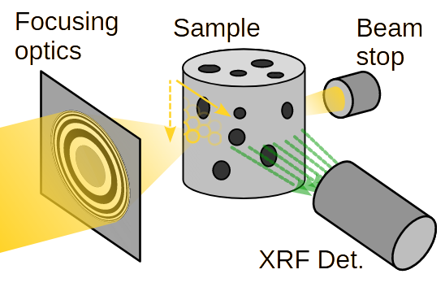
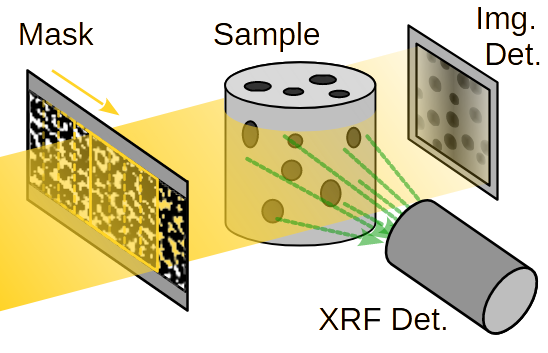

## What is Ghost Imaging?

Ghost imaging (GI) is a technique used in optics and imaging science that allows
for the reconstruction of an image from a light source that has never directly
interacted with the object being imaged.
In a typical setup, a structured light source is used to illuminate an object,
and the light that interacts with the object is collected and detected by a non
spatially resolving detector.
Simultaneously, an image of the structured light source is recorded with detector
array, such as a CCD camera (spatially resolving).
We focus on X-rays, for which these structured beams are usually obtained by
inserting non-configurable transversely-displaced structuring masks in the beam,
to encode the spatial information in the acquired GI signals.

## Why is ghost imaging so interesting?

Develop the following points:
- A new paradigm that offers a tradeoff between resolution, measuring time and dose.
- Can be pushed to very high compressions (i.e. very few realizations compared to number of pixels) -> fast and low dose acquisitions
- It enables resolving scattering signals, which would otherwise require either focusing the beam (which is increasingly hard) or using collimators (which BTW through away most of the emitted photons)
- By illuminating larger regions of the sample at once, we can track the sample drifts during the acquisition (which is not available in some acquisitions, e.g. traditional XRF imaging)
- We can push a technique's resolution beyond the focus or pixel limits.

## X-ray fluorescence ghost imaging

We have recently developed synchrotron-based X-ray fluorescence GI (XRF-GI)
<a href="/publications/#J15">[J15]</a>.
XRF imaging is usually achieved by scanning the samples with a focused beam
(pencil beam, PB), and by collecting the emitted XRF signal (spectrum) with
single-pixel energy-resolving detectors.

  

    
     
    
(a) Pencil Beam

  

  

    
     
    
(b) Ghost Imaging

  

  

    <b>Figure 1:</b> X-ray fluorescence imaging modalities: (a) Pencil Beam scan; (b) Ghost Imaging.
  

In the specific case of XRF-GI, an XRF detector records the spectrum associated
with each illumination pattern.
The XRF energy emission lines corresponding to different chemical elements are
reconstructed into spatially resolved maps, using computational imaging algorithms.
GI acquires spatial information on the whole FoV at each realization.
Thanks to the inherent compressibility of natural images, it is possible to acquire
fewer realizations than the number of pixels in the reconstructed image,
leading to reduced dose deposition, which is not possible with PB scans.

For more information, please visit the dedicated page on the subject: [Synchrotron-based X-ray Fluorescence Ghost Imaging](xrf-gi/).